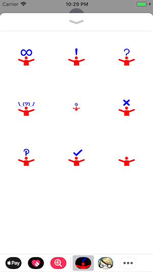
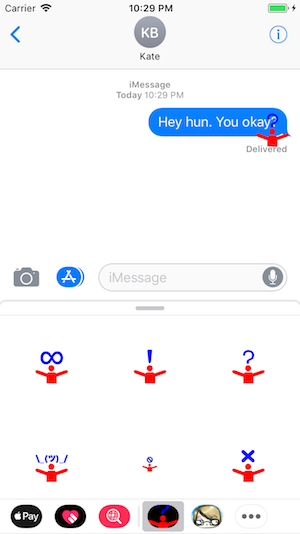

# Hug Stickers for iMessage

Initial Proof of Concept version.

Images made by [inurashii](https://twitter.com/inurashii), exported from the [LGBTQ in Technology](http://lgbtq.technology/) Slack, used by permission.

App/iMessage icon versions, used [MakeAppIcon](https://makeappicon.com/).

## Screenshots

## How to Run

I'm super new to iOS development in general.

I followed [this tutorial on AppCoda](https://www.appcoda.com/message-sticker-app/) to create the repo, which has instructions for testing in the simulator.

And [this on Medium](https://medium.com/swiftist/wireless-debugging-xcode-b6e98e26e022) has instructions for testing (wirelessly!) on a real iOS device.

## Is it on the App Store?

Not yet. I've not paid Apple the $$$ for the privilidge.

## TODO

- [ ] Get hi-res versions of the original images
- [ ] Custom App/iMessage icons

